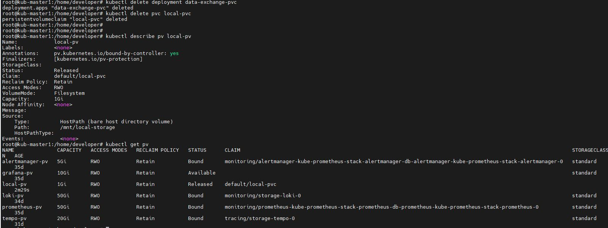

Домашнее задание к занятию «Хранение в K8s» - Бычков Д.В.

Задание 1. Volume: обмен данными между контейнерами в поде

Задание 2. PV, PVC

После удаления Deployment и PVC: PV остается в статусе "Released", потому что у него установлена политика persistentVolumeReclaimPolicy: Retain. Это означает, что данные сохраняются даже после удаления PVC.
После удаления PV: Файл остается на локальном диске ноды, потому что PV с hostPath только монтирует существующую директорию, но не управляет ее жизненным циклом. Kubernetes не удаляет данные при удалении PV с hostPath.

Все команды kubectl выполняются на мастер-нодах kub-master1 и kub-master2, а файлы хранятся на тех рабочих нодах kub-worker1, kub-worker2 и kub-worker3, где Kubernetes scheduler размещает поды.

Задание 3. StorageClass

